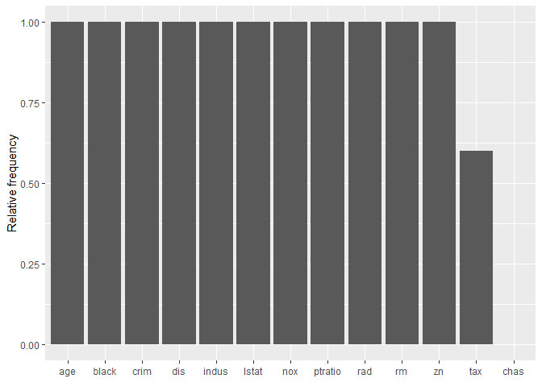

<!-- README.md is generated from README.Rmd. Please edit that file -->

# counterfactuals

<!-- badges: start -->

[](https://github.com/susanne-207/counterfactuals/actions)
[](https://codecov.io/gh/susanne-207/counterfactuals?branch=main)
<!-- badges: end -->

The goal of counterfactuals is to …

## Installation

You can install the development version from
[GitHub](https://github.com/) with:

``` r
# install.packages("devtools")
devtools::install_github("susanne-207/counterfactuals")
```

## Workflow

This is a basic example which shows you how to solve a common problem:

``` r
library(counterfactuals)
library(randomForest)
library(iml)
```

``` r
data("Boston", package  = "MASS")
rf =  randomForest(medv ~ ., data = Boston)
X = Boston[-which(names(Boston) == "medv")]
mod = Predictor$new(rf, data = X)
```

``` r
x_interest = X[1,]
desired_outcome = c(23, 25)
```

``` r
wi_regr = WhatIfRegr$new(mod, n_counterfactuals = 5L)
cfactuals = wi_regr$find_counterfactuals(x_interest, desired_outcome)
```

``` r
cfactuals$data
#>       crim zn indus chas   nox    rm  age    dis rad tax ptratio  black lstat
#> 1: 0.05425  0  4.05    0 0.510 6.315 73.4 3.3175   5 296    16.6 395.60  6.29
#> 2: 0.09178  0  4.05    0 0.510 6.416 84.1 2.6463   5 296    16.6 395.50  9.04
#> 3: 0.11460 20  6.96    0 0.464 6.538 58.7 3.9175   3 223    18.6 394.96  7.73
#> 4: 0.04462 25  4.86    0 0.426 6.619 70.4 5.4007   4 281    19.0 395.63  7.22
#> 5: 0.33045  0  6.20    0 0.507 6.086 61.5 3.6519   8 307    17.4 376.75 10.88
```

``` r
cfactuals$predict()
#>       pred
#> 1 24.65492
#> 2 23.79667
#> 3 24.61399
#> 4 24.51717
#> 5 23.60016
```

``` r
cfactuals$get_diff()
#>       crim  zn indus chas    nox     rm  age     dis rad tax ptratio  black lstat
#> 1: 0.04793 -18  1.74    0 -0.028 -0.260  8.2 -0.7725   4   0     1.3  -1.30  1.31
#> 2: 0.08546 -18  1.74    0 -0.028 -0.159 18.9 -1.4437   4   0     1.3  -1.40  4.06
#> 3: 0.10828   2  4.65    0 -0.074 -0.037 -6.5 -0.1725   2 -73     3.3  -1.94  2.75
#> 4: 0.03830   7  2.55    0 -0.112  0.044  5.2  1.3107   3 -15     3.7  -1.27  2.24
#> 5: 0.32413 -18  3.89    0 -0.031 -0.489 -3.7 -0.4381   7  11     2.1 -20.15  5.90
```

``` r
cfactuals$evaluate()
#>       crim zn indus chas   nox    rm  age    dis rad tax ptratio  black lstat dist_x_interest dist_target nr_changed
#> 1: 0.05425  0  4.05    0 0.510 6.315 73.4 3.3175   5 296    16.6 395.60  6.29      0.06600660   0.3450767         11
#> 2: 0.09178  0  4.05    0 0.510 6.416 84.1 2.6463   5 296    16.6 395.50  9.04      0.08357857   0.7966700         11
#> 3: 0.11460 20  6.96    0 0.464 6.538 58.7 3.9175   3 223    18.6 394.96  7.73      0.08398155   0.3860133         12
#> 4: 0.04462 25  4.86    0 0.426 6.619 70.4 5.4007   4 281    19.0 395.63  7.22      0.09178619   0.4828333         12
#> 5: 0.33045  0  6.20    0 0.507 6.086 61.5 3.6519   8 307    17.4 376.75 10.88      0.10184781   0.6001567         12
```

``` r
cfactuals$plot_freq_of_feature_changes()
```



``` r
cfactuals$plot_surface(names(x_interest)[1:2])
```


