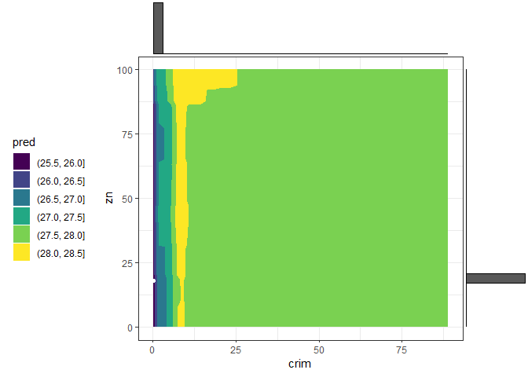

<!-- README.md is generated from README.Rmd. Please edit that file -->

# counterfactuals

<!-- badges: start -->

[](https://github.com/susanne-207/counterfactuals/actions)
[](https://codecov.io/gh/susanne-207/counterfactuals?branch=main)
<!-- badges: end -->

The `counterfactuals` package provides various (model-agnostic)
counterfactual explanation methods via a unified R6-based interface.

Counterfactual explanation methods (or counterfactuals for short)
address questions of the form: “For input **x**<sup>**⋆**</sup>, the
model predicted *y*. What would need to be changed in
**x**<sup>**⋆**</sup> for the model to predict the desired outcome *ỹ*
instead?”.  
Denied loan applications often serve as an example; in this scenario a
counterfactual could be: “The loan was denied because the amount of €30k
is too high given the income. If the amount had been €20k, the loan
would have been granted.”

For an introduction to the topic, we recommend Chapter 6 of the
[Interpretable Machine Learning
book](https://christophm.github.io/interpretable-ml-book/) by Christoph
Molnar.

## Available methods

The following counterfactual explanation methods are currently
implemented:

-   [Multi-Objective Counterfactual Explanations
    (MOC)](https://link.springer.com/chapter/10.1007%2F978-3-030-58112-1_31)
-   [Nearest Instance Counterfactual Explanations
    (NICE)](https://arxiv.org/abs/2104.07411) (an extended version)
-   [WhatIf](https://arxiv.org/abs/1907.04135) (an extended version)

## Installation

You can install the development version from
[GitHub](https://github.com/) with:

``` r
# install.packages("devtools")
devtools::install_github("susanne-207/counterfactuals")
```

## Get started

In this example, we train a `randomForest` on the `iris` dataset and
examine how a given `virginica` observation would have to change in
order to be classified as `versicolor`.

``` r
library(counterfactuals)
library(randomForest)
library(iml)
```

First, we train a `randomForest` model to predict the target variable
`Species`; we leave out one observation from the training data, which is
`x_interest` (the observation to find counterfactuals for).

``` r
rf = randomForest(Species ~ ., data = iris[-150L, ])
```

We then create an
[`iml::Predictor`](https://christophm.github.io/iml/reference/Predictor.html)
object, which serves as a wrapper for different model types and contains
the model and the data for its analysis.

``` r
predictor = Predictor$new(rf, type = "prob")
```

For `x_interest` the model predicts a probability of 8% for class
`versicolor`.

``` r
x_interest = iris[150L, ]
predictor$predict(x_interest)
#>   setosa versicolor virginica
#> 1      0       0.08      0.92
```

Now we examine which features need to be changed to achieve a predicted
probability of at least 50% for class `versicolor`.

Here, we want to apply WhatIf, and since it is a classification task, we
initialize a `WhatIfClassif` object.

``` r
wi_classif = WhatIfClassif$new(predictor, n_counterfactuals = 5L)
```

Then, we use the `find_counterfactuals()` method to find counterfactuals
for `x_interest`.

``` r
cfactuals = wi_classif$find_counterfactuals(
  x_interest, desired_class = "versicolor", desired_prob = c(0.5, 1)
)
```

`cfactuals` is a `Counterfactuals` object that contains the found
counterfactuals and provides several methods for their evaluation and
visualization.

``` r
cfactuals
#> 5 Counterfactual(s) 
#>  
#> Desired class: versicolor 
#> Desired predicted probability range: [0.5, 1] 
#>  
#> Head: 
#>    Sepal.Length Sepal.Width Petal.Length Petal.Width
#> 1:          5.9         3.2          4.8         1.8
#> 2:          6.0         2.7          5.1         1.6
#> 3:          6.7         3.0          5.0         1.7
```

The counterfactuals are stored in the `data` field.

``` r
cfactuals$data
#>    Sepal.Length Sepal.Width Petal.Length Petal.Width
#> 1:          5.9         3.2          4.8         1.8
#> 2:          6.0         2.7          5.1         1.6
#> 3:          6.7         3.0          5.0         1.7
#> 4:          6.0         2.9          4.5         1.5
#> 5:          5.9         3.0          4.2         1.5
```

We can evaluate the results according to various quality measures using
the `evaluate()` method.

``` r
cfactuals$evaluate()
#>    Sepal.Length Sepal.Width Petal.Length Petal.Width dist_x_interest nr_changed dist_train dist_target
#> 1:          5.9         3.2          4.8         1.8      0.03354520          2          0           0
#> 2:          6.0         2.7          5.1         1.6      0.05902778          3          0           0
#> 3:          6.7         3.0          5.0         1.7      0.07020951          3          0           0
#> 4:          6.0         2.9          4.5         1.5      0.07403484          4          0           0
#> 5:          5.9         3.0          4.2         1.5      0.06938559          2          0           0
```

One visualization option is to plot the frequency of feature changes
across all counterfactuals using the `plot_freq_of_feature_changes()`
method.

``` r
cfactuals$plot_freq_of_feature_changes()
```

<!-- -->
