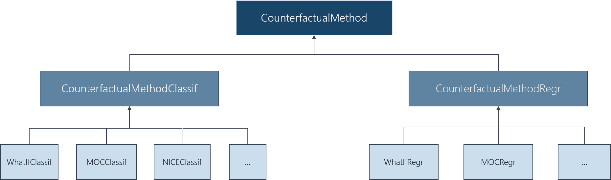
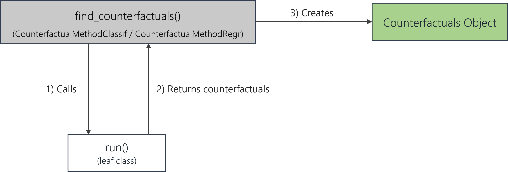

```{r, include = FALSE}
knitr::opts_chunk$set(
  collapse = TRUE,
  comment = "#>"
)
options(width = 200)
```

The variety of counterfactual explanation methods continues to grow as new techniques are actively developed in current 
research. 
A primary objective of the `counterfactuals` package is therefore to be quickly and intuitively extensible with new
state-of-the art counterfactual methods.

In the following, we explain the integration of new methods through the exemplary integration of the  [`featureTweakR` package](https://github.com/katokohaku/featureTweakR) which implements Feature Tweaking of 
Tolomei et al. (2017). 

(Note that `featureTweakR` has a couple of limitations, e.g., that factors in the training data cause problems or that the 
algorithm can only be applied to `randomForests` trained on standardized features.
Therefore, `featureTweakR` is not part of the `counterfactuals` package, but serves as a suitable example for our purpose here.)


## Structure of the counterfactuals package

Before we dive into the implementation details, we briefly explain the structure of the `counterfactuals` package.

### Class diagram
Each counterfactual method (such as `MOC`) is represented by its own `R6` class. Depending on whether it supports
classification or regression tasks, it inherits from the (abstract) `CounterfactualMethodClassif` or
`CounterfactualMethodRegr` class. Counterfactual methods that support both (such as `MOC`) obtain two classes (`MOCClassif` 
and `MOCRegr`). 

```{r img_class_diagram, echo=FALSE, fig.cap="", out.width = '100%'}

```

The key advantage of this approach is that we are able to provide a tailored
`$find_counterfactuals()` interface to the task at hand. 
The leaf classes inherit this method from `CounterfactualMethodClassif` or `CounterfactualMethodRegr`.
For classification tasks `$find_counterfactuals()` has two arguments `desired_class` and `desired_prob` and for regression 
tasks it has one argument `desired_outcome`.

### Call graph

The `$find_counterfactuals()` method (owned by `CounterfactualMethodClassif` and `CounterfactualMethodRegr`) calls a
private `$run()` method. This `$run()` should be implemented by the leaf classes such as `MOCClassif` and `MOCRegr` and 
return the found counterfactuals as `data.table` (preferably) or `data.frame`. 
The actual structure of `$run()` is completely free, which makes it flexible to add new counterfactual methods to the package. 

Based on the counterfactuals returned by `$run()`, the `$find_counterfactuals()` method then creates a `Counterfactuals` 
object.

```{r img_call_diagram, echo=FALSE, fig.cap="", out.width = '75%', out.height='60%', fig.align='center'}

```


## Integrating a new counterfactuals explanation method

To integrate Feature Tweaking, we first we need to install `featureTweakR` and `pforeach` from github and 
load the required libraries.

```{r, eval=FALSE}
devtools::install_github("katokohaku/featureTweakR")
# required for FeatureTweakeR
devtools::install_github("hoxo-m/pforeach")
```

```{r load_libraries, message=FALSE}
library(counterfactuals)
library(randomForest)
library(featureTweakR)
library(data.table)
library(R6)
library(iml)
```

### Class structure

A new class is required to have at least two methods: `$initialize()` and `$run()`. The `print_parameters` is not 
mandatory but strongly encouraged as it gives objects of that class an informative `print` output.

As explained above, depending on the supported task, the new class inherits from either `CounterfactualMethodClassif` or
`CounterfactualMethodRegr.` Since Feature Tweaking supports classification tasks, the new class inherits from the former.

```{r,eval=FALSE}
FeatureTweaker = R6::R6Class("FeatureTweaker", inherit = CounterfactualMethodClassif,
  
  public = list(
    initialize = function() {}
  ),
  
  private = list(
    run = function() {},
    
    print_parameters = function() {}
  )
)
```

### Implement the `$initialize` method

The `$initialize()` method must have a predictor argument (for the [`iml::Predictor`](https://christophm.github.io/iml/reference/Predictor.html) object) and initalizes the super class. 


Additionally, `$initialize()` can have further arguments that are specific to the counterfactual method such as
`ktree`, `epsilon` and `nrep` in this case. We also fill the `$print_parameters()` method with the model specifications.

(Note: For reasons of clarity, we omit argument type checks here).

```{r,eval=FALSE}
FeatureTweaker = R6Class("FeatureTweaker", inherit = CounterfactualMethodClassif,
  
  public = list(
    initialize = function(predictor, ktree = 30L, epsilon = 0.1, nrep = 10L) {
      super$initialize(predictor)
      private$ktree = ktree
      private$epsilon = epsilon
      private$n_rep = n_rep
    }
  ),
  
  private = list(
    ktree = NULL,
    epsilon = NULL,
    n_rep = NULL,
    
    run = function() {},
    
    print_parameters = function() {
      cat(" - epsilon: ", private$epsilon, "\n")
      cat(" - ktree: ", private$ktree, "\n")
      cat(" - n_rep: ", private$n_rep)
    }
  )
)
```

### Implement the `$run` method

The `$run` methods implements the search for counterfactuals.
The workflow of finding counterfactuals with the `featureTweakR` package is explained 
[here](https://github.com/katokohaku/featureTweakR) and essentially consists of these steps:

```{r, eval=FALSE}
# Rule extraction
rules = getRules(rf, ktree = 5L)
# Get e-satisfactory instance 
es = set.eSatisfactory(rules, epsiron = 0.3)
# Compute counterfactuals
tweaked = tweak(
  es, rf, x_interest, label.from = y_hat_interest, label.to = "versicolor", .dopar = FALSE
)
tweaked$suggest
```

The rule extraction is a random process as long the `ktree` is less than the total number of trees in the `randomForest`.
Therefore we can repeat those steps `nrep` times (e.g. by using `sapply`) to obtain multiple counterfactuals.
We can then implement the `$run()` method as follows:

```{r}
FeatureTweaker = R6Class("FeatureTweaker", inherit = CounterfactualMethodClassif,
  
  public = list(
    initialize = function(predictor, ktree = 10L, epsilon = 0.1, nrep = 10L) {
      # adds predictor to private$predictor field
      super$initialize(predictor) 
      private$ktree = ktree
      private$epsilon = epsilon
      private$nrep = nrep
    }
  ),
  
  private = list(
    ktree = NULL,
    epsilon = NULL,
    nrep = NULL,
    
    run = function() {
      predictor = private$predictor
      y_hat_interest = predictor$predict(private$x_interest)
      class_x_interest = names(y_hat_interest)[which.max(y_hat_interest)]
      rf = predictor$model
      
      cfs_list = sapply(seq_len(private$nrep), function(i) {
        rules = getRules(rf, ktree = private$ktree, resample = TRUE)
        e_satisfactory = set.eSatisfactory(rules, epsiron = private$epsilon)
        tweaks = tweak(
          e_satisfactory, rf, private$x_interest, label.from = class_x_interest, 
          label.to = private$desired_class, .dopar = FALSE
        )
        tweaks$suggest
      }, simplify = FALSE, USE.NAMES = TRUE)
      
      cfs = rbindlist(cfs_list)
      # Only return counterfactuals that fullfill desired_prob
      in_desired_prob = between(
        predictor$predict(cfs)[[private$desired_class]], private$desired_prob[1L], private$desired_prob[2L]
      )
      
      cfs[in_desired_prob]
      # Only return unique counterfactuals
      unique(cfs)
    },
    
    print_parameters = function() {
      cat(" - epsilon: ", private$epsilon, "\n")
      cat(" - ktree: ", private$ktree, "\n")
      cat(" - n_rep: ", private$n_rep)
    }
  )
)
```

## Use Case

Now that we have implemented `FeatureTweaker`, we can briefly look at a possible use case.

First we train a `randomForest` model on the `iris` data set and set up the [`iml::Predictor`](https://christophm.github.io/iml/reference/Predictor.html) object).
Note that we leave out one observation from the training data which is our `x_interest`.
```{r}
set.seed(78546)
X = subset(iris, select = -Species)
y = iris$Species
rf = randomForest(X, y, ntree = 20L)
predictor = iml::Predictor$new(rf, data = iris[-120L, ], y = "Species", type = "prob")
```

For `x_interest` the model predicts:
```{r}
x_interest = iris[120L, ]
predictor$predict(x_interest)
```

```{r, echo=FALSE}
# ft_classif = FeatureTweaker$new(predictor, ktree = 10L, nrep = 5L)
# saveRDS(ft_classif, "how-to-add-new-cf-methods-res/ft_classif.RDS")
# cfactuals = ft_classif$find_counterfactuals(
#   x_interest = iris[120L, ], desired_class = "versicolor", desired_prob = c(0.6, 1)
# )
# saveRDS(cfactuals, "how-to-add-new-cf-methods-res/cfactuals.RDS")
ft_classif = readRDS("how-to-add-new-cf-methods-res/ft_classif.RDS")
cfactuals = readRDS("how-to-add-new-cf-methods-res/cfactuals.RDS")
```

Now, we can explore the question: "What would need to be changed such that the model predicts
class 'versicolor' with a class probability of at least 60%?" using Feature Tweaking.

```{r, eval=FALSE}
# Set up FeatureTweaker
ft_classif = FeatureTweaker$new(predictor, ktree = 10L, nrep = 5L)

# Find counterfactuals and create Counterfactuals Object
cfactuals = ft_classif$find_counterfactuals(
  x_interest = iris[120L, ], desired_class = "versicolor", desired_prob = c(0.6, 1)
)

cfactuals
```

```{r, echo=FALSE}
cfactuals
```


## Comments

A limitation of this basic implementation is that we would not be able to find counterfactuals for a setting with 
`max(desired_prob) < 0.5`, since `featureTweakR::tweak` only looks for instances that would be predicted as `desired_class`
by majority vote. To enable this setting we would need to change some `featureTweakR` internal code, but for the sake of 
clarity we will not do this here.


## References

Tolomei, G., Silvestri, F., Haines, A., Lalmas, M.: Interpretable
Predictions of Tree-based Ensembles via Actionable Feature Tweaking. In:
Proceedings of the 23rd ACM SIGKDD International Conference on Knowledge
Discovery and Data Mining. pp. 465--474. KDD '17, ACM, New York, NY, USA
(2017). <https://doi.org/10.1145/3097983.3098039>,
<http://doi.acm.org/10.1145/3097983.3098039>

