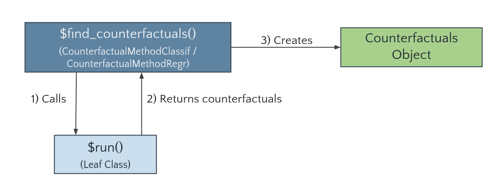

```{r, include = FALSE}
knitr::opts_chunk$set(
  collapse = TRUE,
  comment = "#>"
)
options(width = 200)

library(devtools)
if (!require("featureTweakR")) { 
  install_github("katokohaku/featureTweakR")
}
if (!require("pforeach")) {
  install_github("hoxo-m/pforeach")
}
```

In the following, we illustrate how further methods can be added to the `counterfactuals` package by integrating
the [`featureTweakR`](https://github.com/katokohaku/featureTweakR) package, which implements Feature Tweaking of 
Tolomei et al. (2017). 

(Note that the `featureTweakR` package has a couple of limitations, e.g., that factors in the training data cause problems or 
that the algorithm is only applicable to `randomForests` trained on standardized features.
Therefore, `featureTweakR` is not part of the `counterfactuals` package, but serves as a suitable example for our purpose here.)


## Structure of the counterfactuals package

Before we dive into the implementation details, we briefly explain the structure of the `counterfactuals` package.

### Class diagram
Each counterfactual method is represented by its own `R6` class. Depending on whether a counterfactual method 
supports classification or regression tasks, it inherits from the (abstract) `CounterfactualMethodClassif` or
`CounterfactualMethodRegr` classes, respectively. Counterfactual methods that support both tasks are split into two separate classes;
for instance, as MOC is applicable to classification and regression tasks, we implement two classes: `MOCClassif` and `MOCRegr`.

```{r img_class_diagram, echo=FALSE, fig.cap="", out.width = '70%', fig.align='center'}
knitr::include_graphics("figures/class-diagram.png")
```

Leaf classes (like `MOCClassif` and `MOCRegr`) inherit the `find_counterfactuals()` method from `CounterfactualMethodClassif`
or `CounterfactualMethodRegr`, respectively.
The key advantage of this approach is that we are able to provide a tailored `find_counterfactuals()` interface to the task at hand:
for classification tasks `find_counterfactuals()` has two arguments `desired_class` and `desired_prob` and for regression 
tasks it has one argument `desired_outcome`.

### Call graph

The `find_counterfactuals()` method calls a private `run()` method (1)---implemented by the leaf classes---which performs the 
search and returns the counterfactuals as a `data.table` (2). The `find_counterfactuals()` method then creates a `Counterfactuals` 
object, which contains the counterfactuals and provides several methods for their evaluation and visualization (3).

```{r img_call_diagram, echo=FALSE, fig.cap="", out.width = '60%', out.height='60%', fig.align='center'}

```


## Integrating a new counterfactuals explanation method

To integrate Feature Tweaking, we first need to install `featureTweakR` and `pforeach` and load the required libraries.

```{r, eval=FALSE}
devtools::install_github("katokohaku/featureTweakR")
# required for FeatureTweakeR
devtools::install_github("hoxo-m/pforeach")
```

```{r load_libraries, message=FALSE}
library(counterfactuals)
library(randomForest)
library(featureTweakR)
library(R6)
```

### Class structure

A new leaf class needs at least two methods: `initialize()` and `run()`. The method `print_parameters()` is not 
mandatory, but strongly recommended as it gives objects of that class an informative `print()` output.

As elaborated above, the new class inherits from either `CounterfactualMethodClassif` or `CounterfactualMethodRegr`, depending 
on which task it supports. Because Feature Tweaking supports classification tasks, the new `FeatureTweakerClassif` class inherits from
the former.

```{r,eval=FALSE}
FeatureTweakerClassif = R6::R6Class("FeatureTweakerClassif", inherit = CounterfactualMethodClassif,
  
  public = list(
    initialize = function() {}
  ),
  
  private = list(
    run = function() {},
    
    print_parameters = function() {}
  )
)
```

### Implement the `$initialize` method

The `initialize()` method must have a predictor argument that takes an
[`iml::Predictor`](https://giuseppec.github.io/iml/reference/Predictor.html) object.  In addition, it may
have further arguments that are specific to the counterfactual method such as `ktree`, `epsiron`, and `resample` in this case. 
For argument checks, we recommend the [`checkmate`](https://mllg.github.io/checkmate/) package. 
We also fill the `print_parameters()` method with the parameters of Feature Tweaking.

```{r,eval=FALSE}
FeatureTweakerClassif = R6Class("FeatureTweakerClassif", inherit = CounterfactualMethodClassif,
  
  public = list(
     initialize = function(predictor, ktree = NULL, epsiron = 0.1, 
      resample = FALSE) {
      # adds predictor to private$predictor field
      super$initialize(predictor) 
      private$ktree = ktree
      private$epsiron = epsiron
      private$resample = resample
    }
  ),
  
  private = list(
    ktree = NULL,
    epsiron = NULL,
    resample = NULL,
    
    run = function() {},
    
    print_parameters = function() {
      cat(" - epsiron: ", private$epsiron, "\n")
      cat(" - ktree: ", private$ktree, "\n")
      cat(" - resample: ", private$resample)
    }
  )
)
```

### Implement the `$run` method

The `run()` method performs the search for counterfactuals. Its structure is completely free, which makes it flexible to 
add new counterfactual methods to the `counterfactuals` package.

The workflow of finding counterfactuals with the `featureTweakR` package is explained 
[here](https://github.com/katokohaku/featureTweakR) and essentially consists of these steps:

```{r, eval=FALSE}
# Rule extraction
rules = getRules(rf, ktree = 5L)
# Get e-satisfactory instance 
es = set.eSatisfactory(rules, epsiron = 0.3)
# Compute counterfactuals
tweaked = tweak(
  es, rf, x_interest, label.from = ..., label.to = ..., .dopar = FALSE
)
tweaked$suggest
```

As long as `ktree`---the number of trees to parse---is smaller than the total number of trees
in the `randomForest`, the rule extraction is a random process. Hence, these steps can be
repeated `resample` times to obtain multiple counterfactuals.

```{r}
FeatureTweakerClassif = R6Class("FeatureTweakerClassif", 
  inherit = CounterfactualMethodClassif,
  
  public = list(
    initialize = function(predictor, ktree = NULL, epsiron = 0.1, 
      resample = FALSE) {
      # adds predictor to private$predictor field
      super$initialize(predictor) 
      private$ktree = ktree
      private$epsiron = epsiron
      private$resample = resample
    }
  ),
  
  private = list(
    ktree = NULL,
    epsiron = NULL,
    resample = NULL,
    
    run = function() {
      # Extract info from private fields
      predictor = private$predictor
      y_hat_interest = predictor$predict(private$x_interest)
      class_x_interest = names(y_hat_interest)[which.max(y_hat_interest)]
      rf = predictor$model
      
      # Search counterfactuals by calling functions in featureTweakR 
      rules = getRules(rf, ktree = private$ktree, resample = private$resample)
      es = set.eSatisfactory(rules, epsiron = private$epsiron)
      tweaks = featureTweakR::tweak(
        es, rf, private$x_interest, label.from = class_x_interest, 
        label.to = private$desired_class, .dopar = FALSE
      )
      res <- tweaks$suggest
    },
    
    print_parameters = function() {
      cat(" - epsiron: ", private$epsiron, "\n")
      cat(" - ktree: ", private$ktree, "\n")
      cat(" - resample: ", private$resample)
    }
  )
)
```

## Use Case

Now, that we have implemented `FeatureTweakerClassif`, let's look at a short application to the `iris` dataset.

First, we train a `randomForest` model on the `iris` data set and set up the
[`iml::Predictor`](https://giuseppec.github.io/iml/reference/Predictor.html) object, omitting `x_interest` from the
training data.

```{r}
set.seed(78546)
X = subset(iris, select = -Species)[- 130L,]
y = iris$Species[-130L]
rf = randomForest(X, y, ntree = 20L)
predictor = iml::Predictor$new(rf, data = iris[-130L, ], y = "Species", type = "prob")
```

For `x_interest`, the model predicts a probability of 25% for `versicolor`. 
```{r}
x_interest = iris[130L, ]
predictor$predict(x_interest)
```

```{r, echo=FALSE, message=FALSE}
if (!file.exists("how-to-add-new-cf-methods-res/ft_classif.RDS")) {
    ft_classif = FeatureTweakerClassif$new(predictor, ktree = 10L, resample = TRUE)
    saveRDS(ft_classif, "how-to-add-new-cf-methods-res/ft_classif.RDS")
    cfactuals = ft_classif$find_counterfactuals(
      x_interest = x_interest, desired_class = "versicolor", desired_prob = c(0.6, 1)
    )
    saveRDS(cfactuals, "how-to-add-new-cf-methods-res/cfactuals.RDS")
}

# saveRDS(cfactuals, "how-to-add-new-cf-methods-res/cfactuals.RDS")
ft_classif = readRDS("how-to-add-new-cf-methods-res/ft_classif.RDS")
cfactuals = readRDS("how-to-add-new-cf-methods-res/cfactuals.RDS")
```

Now, we use Feature Tweaking to address the question: "What would need to change in `x_interest` for the model to
predict a probability of at least 60% for`versicolor`.


```{r, eval=FALSE}
# Set up FeatureTweakerClassif
ft_classif = FeatureTweakerClassif$new(predictor, ktree = 10L, resample = TRUE)

# Find counterfactuals and create Counterfactuals Object
cfactuals = ft_classif$find_counterfactuals(
  x_interest = x_interest, desired_class = "versicolor", desired_prob = c(0.6, 1)
)
```

Just as for the existing methods, the result is a `Counterfactuals` object.


## Comments

A minor limitation of this basic implementation is that we would not be able to find counterfactuals for a setting with 
`max(desired_prob) < 0.5`, since `featureTweakR::tweak` only searches for instances that would be predicted as `desired_class`
by majority vote. To enable this setting, we would need to change some `featureTweakR` internal code, but for the sake of 
clarity we will not do this here.


## References

Tolomei, G., Silvestri, F., Haines, A., Lalmas, M.: Interpretable Predictions of Tree-based Ensembles via Actionable 
Feature Tweaking. In: Proceedings of the 23rd ACM SIGKDD International Conference on Knowledge Discovery and Data Mining. 
pp. 465--474. KDD '17, ACM, New York, NY, USA (2017). \doi{10.1145/3097983.3098039}.

